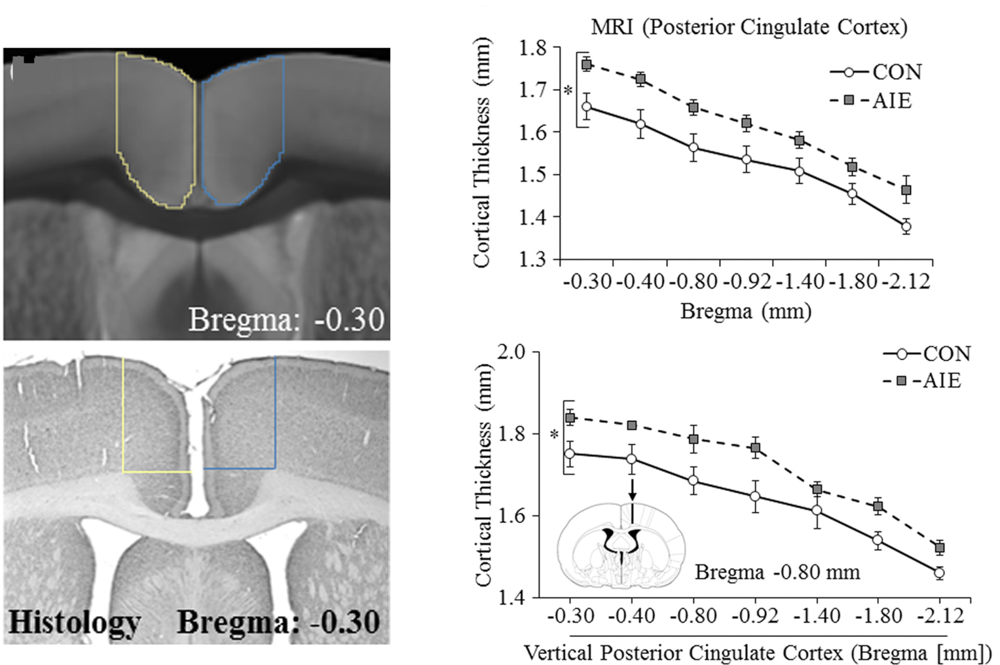
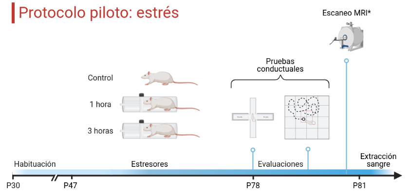

```{r xaringanExtra, echo=FALSE}
xaringanExtra::use_xaringan_extra(c("tile_view", "animate_css", "tachyons"))
```

```{r xaringan-panelset, echo=FALSE}
xaringanExtra::use_panelset()
```

```{r xaringan-scribble, echo=FALSE}
xaringanExtra::use_scribble()
```

```{r progress, echo = FALSE}
xaringanExtra::use_progress_bar(color = "#0051BA", location = "bottom", height = "5px")
```

## Diseño experimental
----
<br/>
<br/>

```{r echo=FALSE, fig.align='center', out.width='100%'}
knitr::include_graphics('images/hipo.png')
```

---

## Trastorno por uso de alcohol
----
Patrón desadaptativo de consumo que conlleva un deterioro o malestar clínicamente significativo expresado por tres o más de los siguientes síntomas (DSM-V):

1. Tolerancia
2. Abstinencia
3. Grandes cantidades de consumo
4. Deseo persistente de consumo
5. Se emplea mucho tiempo para búsqueda y consumo
6. Abandono de actividades placenteras por búsqueda
7. Persistencia de consumo pese a consecuencias

.footnote[----
American Psychiatric Association. (2013). Diagnostic and statistical manual of mental disorders (5th ed.)]

---

## Elección de alcohol por 2 botellas
----
- Consumo voluntario por el alcohol.  
- Los animales tienen acceso a 2 botellas: una con agua y una de solución de etanol al 20% <span style="color:Blue">(Tabakoff $\&$ Hoffman, 2000)</span>.

<br/>

```{r echo=FALSE, fig.align='center', out.width='70%'}
knitr::include_graphics('images/twobottle2.png')
```

.footnote[----
Tabakoff $\&$ Hoffman. (2000). Animal Models in Alcohol Research]

---

## Fenotipo por alcohol crónico
----
```{r echo=FALSE, fig.align='center', out.width='70%'}

```
<p style="font-size:14pt">
Aumento del grosor cortical del grupo del etanol en ratas Wistar adolescentes (AIE) comparado con un control (CON) en el cingulado posterior, detectado por resonancia magnética (MRI) e inmunohistoquímica <span style="color:Blue"> (Vetreno et al., 2017)</span>
</p>

.footnote[----
Vetreno et al. (2017). Adult rat cortical thickness changes across age and following adolescent intermittent ethanol treatment]

---

## Estrés
----
- Percepción de la demanda excesiva del ambiente sobre la capacidad de un organismo <span style="color:Blue"> (Ruisoto $\&$ Contador, 2019) </span>
- Implica varios cambios fisiológicos que incluyen la activación del eje HPA.

```{r echo=FALSE, fig.align='center', out.width='40%'}
knitr::include_graphics('images/hpa2.png')
```

<p style="font-size:14pt" align="center"> Eje hipotálamo-pituitaria-adrenal (HPA) <span style="color:Blue">(Joachim $\&$ Spangler, 2013)</span> </p>

.footnote[----
Ruisoto $\&$ Contador. (2019). The role of stress in drug addiction. An integrative review]

---

## Fenotipo de estrés crónico
----

<br/>

```{r echo=FALSE, fig.align='center', out.width='90%'}

```

<br/>
<p style="font-size:14pt">
Cambios cerebrales funcionales dentro de la prefrontal (PFC) de ratas Wistar del grupo de estrés con cambios comparados al control, y la observación de hipotrofía en las dendritas de las células piramidales <span style="color:Blue">(Henckens et al., 2015)</span> </p>

.footnote[----
Henckens et al. (2013). Stress-induced alterations in large-scale functional networks of the rodent brain]

---

## Interacción AUD-Estrés
----

- Incremento en el consumo de alcohol debido a intervenciones de estrés.

```{r echo=FALSE, fig.align='center', out.width='75%'}
knitr::include_graphics('images/sisali.png')
```
<p style="font-size:14pt"> 
Promedio de consumo durante la intervención a estrés (restricción) en ratas Wistar <span style="color:Blue">(Gomez et al., 2012)</span>
</p>

.footnote[----
Gomez, et al. (2012). The interaction of chronic restraint stress and voluntary alcohol intake: effects on spatial memory in male rats]

---
class: inverse, middle, center
background-image: images/restraint.png
background-size: contain

# Piloto de Estrés

---

## Método
----

### Animales

- 12 ratas Wistar (P30: )

### Materiales

- Restrictor de movimiento construido en acrílico con ajuste para el tamaño de la rata

<br/>

```{r echo=FALSE, fig.align='center', out.width='60%'}

```

---

## 
</br>
```{r echo=FALSE, fig.align='center', out.width='90%'}

```
</br>

<p style="font-size:14pt">
- Ambiente controlado con acceso libre al agua y comida </br>
- Ciclo invertido 12h (oscuridad/luz) </br>
- Restricción: lapso 11:00-14:00 (20/31) </br>
- El peso corporal, el alimento y el consumo de agua fueron medidos diariamente como medidores de respuesta a estrés <span style="color:Blue">(Martí et al., 1994)</span>.
</p>

.footnote[----
Martí, O., Martí, J., & Armario, A. (1994). Effects of chronic stress on food intake in rats: influence of stressor intensity and duration of daily exposure]

---

## Pruebas conductuales
----

</br>
</br>

```{r echo=FALSE, fig.align='center', out.width='90%'}

```

- LEC: 5 minutos
- CA: 10 minutos 

---
class: inverse, middle, center
background-image: images/restraint.png
background-size: contain

# Resultados

---

## Crecimiento y consumo

.panelset[
.panel[.panel-name[Crecimiento]

```{r echo=FALSE, fig.height=6.3, fig.width=11.8, message=FALSE, warning=FALSE, cache=FALSE, paged.print=FALSE, results='asis'}

setwd("/home/jalil/Documents/stress")
pacman::p_load(tidyverse,ggthemes,cowplot,ggstatsplot,ggpubr, plotly)
stress_batch1<-read_csv("Stress_pilot.csv")

stress_batch1_Weight<-stress_batch1 %>% group_by(Group,Age) %>% summarise(Weight=mean(Weight))  %>% 
  ggplot(aes(x=Age,y=Weight,color=as.factor(Group))) + geom_point() + geom_line() +
  geom_rangeframe() + theme_tufte() + ylab("Peso") + xlab("Edad") +
  theme(legend.position = "bottom", legend.title = element_text(face="bold", size=20), 
  legend.text = element_text(size=18),
  axis.text = element_text(size=16), axis.title = element_text(size=18)) +
  scale_color_excel_new(name = "Grupo", labels = c("1 Hr", "3 Hrs", "Ctrl")) +
  scale_x_discrete(breaks = c("P47", "P52", "P57", "P62", "P67", "P72", "P77"))

ggplotly(stress_batch1_Weight)

```

]
.panel[.panel-name[Comparación]

```{r echo=FALSE, fig.height=6.3, fig.width=11.8, message=FALSE, warning=FALSE, cache=FALSE, paged.print=FALSE, results='asis'}
stress_batch1_Weight_comparison<-stress_batch1 %>% group_by(Group,Age) %>% 
  summarise(Weight=mean(Weight)) %>%
  ggbetweenstats(x=Group,y=Weight, type = "np", p.adjust.method = "fdr") +
  scale_x_discrete(labels = c("1 Hr", "3 Hrs", "Ctrl")) + xlab(element_blank()) + ylab("Peso") +
  theme(axis.text = element_text(size = 16), axis.title = element_text(size=18), 
  plot.caption=element_blank()) + 
  scale_color_excel_new()

ggplotly(stress_batch1_Weight_comparison)

```

]
.panel[.panel-name[Comida]

```{r echo=FALSE, fig.height=6.3, fig.width=11.8, message=FALSE, warning=FALSE, cache=FALSE, paged.print=FALSE, results='asis'}
stress_batch1_food_comparison<-stress_batch1 %>% group_by(Group,Age) %>% 
  summarise(Food=mean(Food_cons)) %>%
  ggbetweenstats(x=Group,y=Food, type = "np", p.adjust.method = "fdr") +
  scale_x_discrete(labels = c("1 Hr", "3 Hrs", "Ctrl")) + ylab("Consumo de comida") + xlab(element_blank()) +
  theme(axis.text = element_text(size = 16), axis.title = element_text(size=18)) + 
  scale_color_excel_new()

ggplotly(stress_batch1_food_comparison)

```

]
.panel[.panel-name[Agua]

```{r echo=FALSE, fig.height=6.3, fig.width=11.8, message=FALSE, warning=FALSE, cache=FALSE, paged.print=FALSE, results='asis'}
stress_batch1_Water_comparison<-stress_batch1 %>% group_by(Group,Age) %>% 
  summarise(Water=mean(Water_cons)) %>%
  ggbetweenstats(x=Group,y=Water, type = "np", p.adjust.method = "fdr") +
  scale_x_discrete(labels = c("1 Hr", "3 Hrs", "Ctrl")) + ylab("Consumo de Agua") + xlab(element_blank()) +
  theme(axis.text = element_text(size = 16), axis.title = element_text(size=18)) + 
  scale_color_excel_new()

ggplotly(stress_batch1_Water_comparison)

```

]
]

---

## Campo abierto

.panelset[
.panel[.panel-name[Centro]

```{r echo=FALSE, fig.height=6.3, fig.width=11.8, message=FALSE, warning=FALSE, cache=FALSE, paged.print=FALSE, results='asis'}
setwd("/home/jalil/Documents/stress")
pacman::p_load(tidyverse,ggthemes,cowplot,ggstatsplot,plotly)
OF_list <- list.files(getwd(), pattern = "*ComprehensiveOutputData.csv", recursive = TRUE)
OF_raw <- OF_list %>% map(read_csv, skip = 58) %>% reduce(rbind) %>% 
  select(ID = "SUBJECT ID", Duration = "DURATION (s)", Distance = "TOTAL DISTANCE (cm)", Rest = "REST TIME (s)", 
  Movement = "MOVEMENT TIME (s)", Stereotypic = "STEREOTYPIC EPISODE COUNT", Margin = "MARGIN TIME LEGACY (s)", Center = "CENTER TIME LEGACY (s)", 
  Margin_dis = "MARGIN DISTANCE LEGACY (cm)", Center_dis = "CENTER DISTANCE LEGACY (cm)") %>% filter(Duration == 600) 
  
OF_raw <- OF_raw %>% cbind(Grupo = c("3_hr", "Ctrl", "1_hr", "Ctrl", "Ctrl", "1_hr", "3_hr", "3_hr", "Ctrl", "1_hr"))
OF_raw <- OF_raw %>% cbind(Fecal = c(2, 1, 1, 0, 0, 0, 0, 4, 2, 3))

OF_center <- OF_raw %>%
  ggbetweenstats(x=Grupo,y=Center, type = "np", p.adjust.method = "fdr", results.subtitle = F) +
  scale_x_discrete(labels = c("1 Hr", "3 Hrs", "Ctrl")) + xlab(element_blank()) +
  theme(axis.text = element_text(size = 16), axis.title = element_text(size=18),
  plot.caption=element_blank()) + ylab("Tiempo en centro") +
  scale_color_excel_new()

ggplotly(OF_center)

```

]
.panel[.panel-name[Márgenes]
```{r echo=FALSE, fig.height=6.3, fig.width=11.8, message=FALSE, warning=FALSE, cache=FALSE, paged.print=FALSE, results='asis'}
OF_margin <- OF_raw %>%
  ggbetweenstats(x=Grupo,y=Margin, type = "np", p.adjust.method = "fdr", results.subtitle = F) +
  scale_x_discrete(labels = c("1 Hr", "3 Hrs", "Ctrl")) + xlab(element_blank()) + ylab("Tiempo en márgenes") +
  theme(axis.text = element_text(size = 16), axis.title = element_text(size=18),
  plot.caption=element_blank()) +
  scale_color_excel_new()
ggplotly(OF_margin)

```
]
.panel[.panel-name[Centro Dis]
```{r echo=FALSE, fig.height=6.3, fig.width=11.8, message=FALSE, warning=FALSE, cache=FALSE, paged.print=FALSE, results='asis'}
OF_Center_dis <- OF_raw %>%
  ggbetweenstats(x=Grupo,y=Center_dis, type = "np", p.adjust.method = "fdr", results.subtitle = F) +
  scale_x_discrete(labels = c("1 Hr", "3 Hrs", "Ctrl")) + ylab("Distancia en centro") + xlab(element_blank()) +
  theme(axis.text = element_text(size = 16), axis.title = element_text(size=18),
  plot.caption=element_blank()) + 
  scale_color_excel_new()
ggplotly(OF_Center_dis)

```
]
.panel[.panel-name[Márgenes Dis]
```{r echo=FALSE, fig.height=6.3, fig.width=11.8, message=FALSE, warning=FALSE, cache=FALSE, paged.print=FALSE, results='asis'}
OF_Margin_dis <- OF_raw %>%
  ggbetweenstats(x=Grupo,y=Margin_dis, type = "np", p.adjust.method = "fdr", results.subtitle = F) +
  scale_x_discrete(labels = c("1 Hr", "3 Hrs", "Ctrl")) + ylab("Distancia en márgenes") + xlab(element_blank()) +
  theme(axis.text = element_text(size = 16), axis.title = element_text(size=18),
  plot.caption=element_blank()) + 
  scale_color_excel_new()
ggplotly(OF_Margin_dis)

```
]
.panel[.panel-name[Distancia]
```{r echo=FALSE, fig.height=6.3, fig.width=11.8, message=FALSE, warning=FALSE, cache=FALSE, paged.print=FALSE, results='asis'}
OF_distance <- OF_raw %>%
  ggbetweenstats(x=Grupo,y=Distance, type = "np", p.adjust.method = "fdr", results.subtitle = F) +
  scale_x_discrete(labels = c("1 Hr", "3 Hrs", "Ctrl")) + xlab(element_blank()) +
  theme(axis.text = element_text(size = 16), axis.title = element_text(size=18),
  plot.caption=element_blank()) + ylab("Distancia") +
  scale_color_excel_new()
ggplotly(OF_distance)

```
]
.panel[.panel-name[Heces]
```{r echo=FALSE, fig.height=6.3, fig.width=11.8, message=FALSE, warning=FALSE, cache=FALSE, paged.print=FALSE, results='asis'}
OF_Fecal <- OF_raw %>%
  ggbetweenstats(x=Grupo,y=Fecal, type = "np", p.adjust.method = "fdr", results.subtitle = F) +
  scale_x_discrete(labels = c("1 Hr", "3 Hrs", "Ctrl")) + xlab(element_blank()) +
  theme(axis.text = element_text(size = 16), axis.title = element_text(size=18),
  plot.caption=element_blank()) + ylab("Heces") +
  scale_color_excel_new()
ggplotly(OF_Fecal)

```
]
]

---

## Laberinto en cruz (por inspección)

.panelset[
.panel[.panel-name[Centro]

```{r echo=FALSE, fig.height=6.3, fig.width=11.8, message=FALSE, warning=FALSE, cache=FALSE, paged.print=FALSE, results='asis'}
setwd("/home/jalil/Documents/stress")
pacman::p_load(tidyverse,ggthemes,cowplot,ggstatsplot,plotly)
EPM_read=read_csv("EPM/inspection_co.csv")

EPM_centro=EPM_read %>% filter(Zona=="Centro") %>%
  ggbetweenstats(x=Grupo,y=Tiempo, type = "np", p.adjust.method = "fdr", results.subtitle = T,
                 grouping.var=Zona) + 
  xlab(element_blank()) + theme(axis.text = element_text(size = 16), axis.title = element_text(size=18),
        plot.caption=element_blank()) + ylab(element_text("Tiempo")) +
  scale_color_excel_new()

ggplotly(EPM_centro)

```

]
.panel[.panel-name[Abierto]
```{r echo=FALSE, fig.height=6.3, fig.width=11.8, message=FALSE, warning=FALSE, cache=FALSE, paged.print=FALSE, results='asis'}
EPM_abierto=EPM_read %>% filter(Zona=="Abierto") %>%
  ggbetweenstats(x=Grupo,y=Tiempo, type = "np", p.adjust.method = "fdr", results.subtitle = T,
                 grouping.var=Zona) + 
  xlab(element_blank()) + theme(axis.text = element_text(size = 16), axis.title = element_text(size=18),
                                plot.caption=element_blank()) + ylab(element_text("Tiempo")) +
  scale_color_excel_new()
ggplotly(EPM_abierto)

```
]
.panel[.panel-name[Cerrado]
```{r echo=FALSE, fig.height=6.3, fig.width=11.8, message=FALSE, warning=FALSE, cache=FALSE, paged.print=FALSE, results='asis'}
EPM_cerrado=EPM_read %>% filter(Zona=="Cerrado") %>%
  ggbetweenstats(x=Grupo,y=Tiempo, type = "np", p.adjust.method = "fdr", results.subtitle = T,
                 grouping.var=Zona) + 
  xlab(element_blank()) + theme(axis.text = element_text(size = 16), axis.title = element_text(size=18),
                                plot.caption=element_blank()) + ylab(element_text("Tiempo")) +
  scale_color_excel_new()
ggplotly(EPM_cerrado)

```
]
]

---
background-image: url("assets/DLC.png")
background-size: 120px
background-position: 90% 2%

## Laberinto en cruz (DLC)

.panelset[
.panel[.panel-name[Rata 01]
.scroll-box-20[
```{r echo=FALSE, fig.align='center', out.width='75%'}

```
]
]
.panel[.panel-name[Rata 02]
.scroll-box-20[
```{r echo=FALSE, fig.align='center', out.width='75%'}

```
]
]
.panel[.panel-name[Rata 03]
.scroll-box-20[
```{r echo=FALSE, fig.align='center', out.width='75%'}

```
]
]
]

---

## Perspectiva experimental
----

```{r echo=FALSE, fig.align='center', out.width='85%'}

```

---

## 

</br>

```{r echo=FALSE, fig.align='center', out.width='90%'}

```

<span style="color:Blue">Neuroimagen</span>
  - sMRI, rsMRI, dMRI  
  
<span style="color:Blue">Comportamiento</span>
  - Peso, consumo, PC (LEC, Preferencia lugar, reconocimiento objetos)  

<span style="color:Blue">Histología</span>

---
class: inverse, middle, center
background-size: contain

## Gracias
