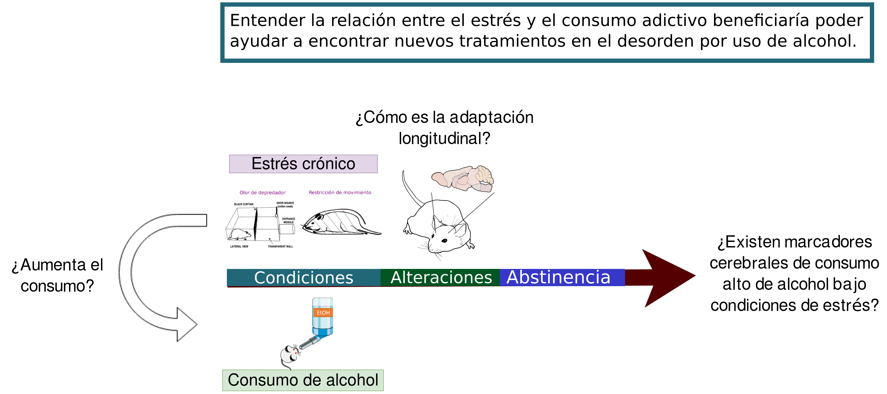
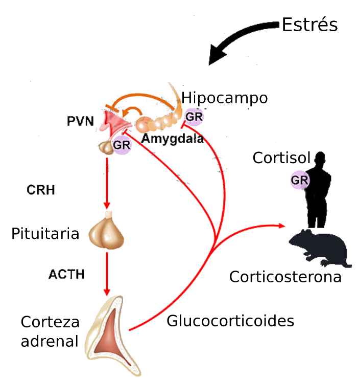
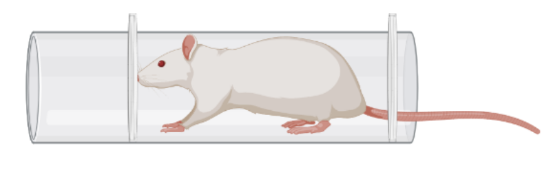
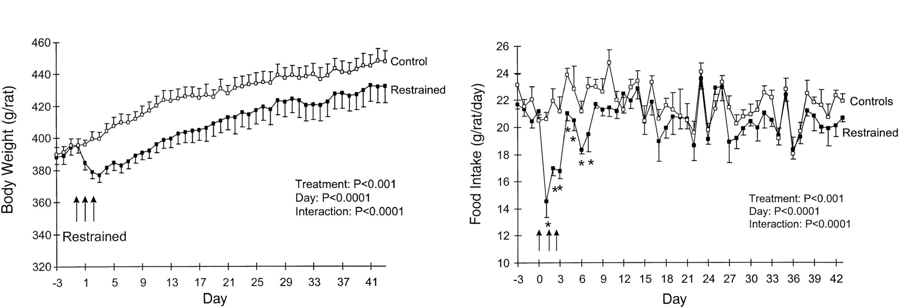
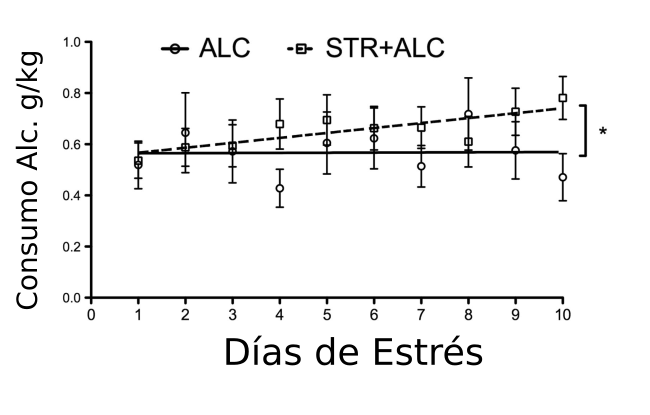
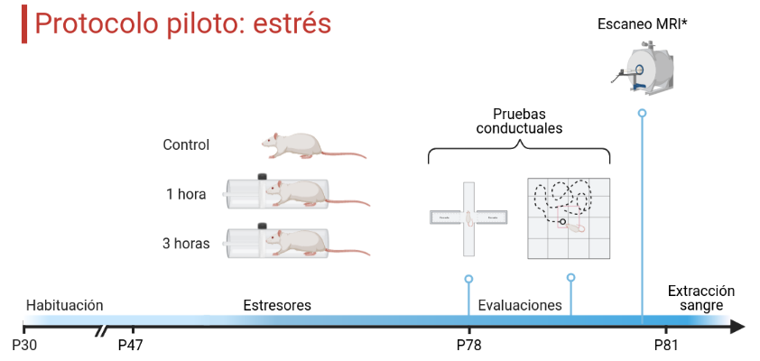
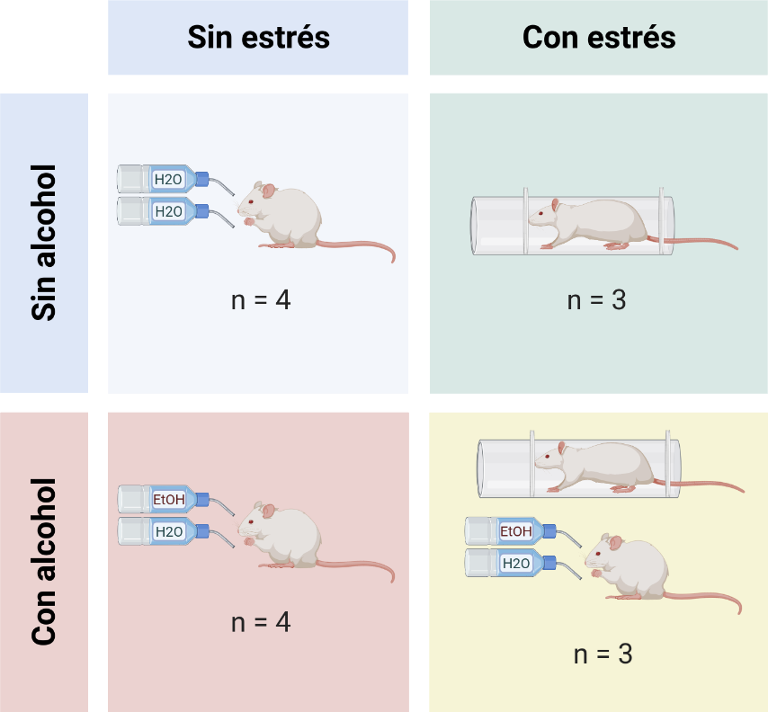
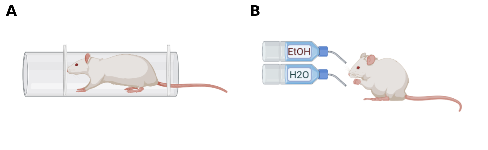
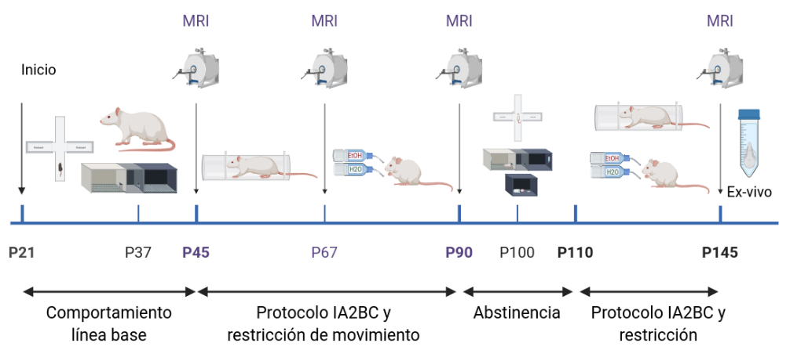
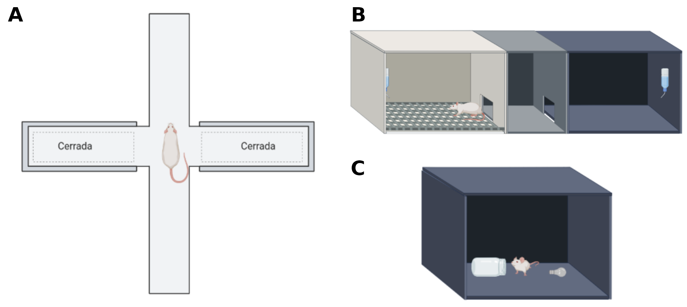

```{r xaringanExtra, echo=FALSE}
xaringanExtra::use_xaringan_extra(c("tile_view", "animate_css", "tachyons"))
```

```{r xaringan-panelset, echo=FALSE}
xaringanExtra::use_panelset()
```

```{r xaringan-scribble, echo=FALSE}
xaringanExtra::use_scribble()
```

```{r progress, echo = FALSE}
xaringanExtra::use_progress_bar(color = "#0051BA", location = "bottom", height = "5px")
```

## Diseño experimental
----
<br/>
<br/>

```{r echo=FALSE, fig.align='center', out.width='100%'}

```

---

## Trastorno por uso de alcohol
----
Patrón desadaptativo de consumo que conlleva un deterioro o malestar clínicamente significativo expresado por tres o más de los siguientes síntomas (DSM-V):

1. Tolerancia
2. Abstinencia
3. Grandes cantidades de consumo
4. Deseo persistente de consumo
5. Se emplea mucho tiempo para búsqueda y consumo
6. Abandono de actividades placenteras por búsqueda
7. Persistencia de consumo pese a consecuencias

.footnote[----
American Psychiatric Association. (2013). Diagnostic and statistical manual of mental disorders (5th ed.)]

---

## Elección de alcohol por 2 botellas
----
- Consumo voluntario por el alcohol.  
- Los animales tienen acceso a 2 botellas: una con agua y una de solución de etanol al 20% <span style="color:Blue">(Tabakoff $\&$ Hoffman, 2000)</span>.

<br/>

```{r echo=FALSE, fig.align='center', out.width='70%'}

```

.footnote[----
Tabakoff $\&$ Hoffman. (2000). Animal Models in Alcohol Research]

---

## Estrés
----
- Percepción de la demanda excesiva del ambiente sobre la capacidad de un organismo <span style="color:Blue"> (Ruisoto $\&$ Contador, 2019) </span>
- Implica varios cambios fisiológicos que incluyen la activación del eje HPA.

```{r echo=FALSE, fig.align='center', out.width='40%'}

```

<p style="font-size:14pt" align="center"> Eje hipotálamo-pituitaria-adrenal (HPA) <span style="color:Blue">(Joachim $\&$ Spangler, 2013)</span> </p>

.footnote[----
Ruisoto $\&$ Contador. (2019). The role of stress in drug addiction. An integrative review]

---

## Modelo de estrés
----

- Estresor físico: restricción de movimiento.

```{r echo=FALSE, fig.align='center', out.width='40%'}

```

```{r echo=FALSE, fig.align='center', out.width='90%'}

```
<p style="font-size:13pt"> 
Peso corporal diario (±SE) de grupos de 6 ratas macho Sprague-Dawley restringidas durante 3 h/día <span style="color:Blue">(Harris et al., 1998)</span>.
</p>

.footnote[----
Harris et al. (1998). Effect of repeated stress on body weight and body composition of rats fed low- and high-fat diets]

---

## Interacción AUD-Estrés
----

- Incremento en el consumo de alcohol debido a intervenciones de estrés.

```{r echo=FALSE, fig.align='center', out.width='75%'}

```
<p style="font-size:14pt"> 
Promedio de consumo durante la intervención a estrés (restricción) en ratas Wistar <span style="color:Blue">(Gomez et al., 2012)</span>
</p>

.footnote[----
Gomez, et al. (2012). The interaction of chronic restraint stress and voluntary alcohol intake: effects on spatial memory in male rats]

---

## Objetivo 
----

.blockquote[
Determinar la influencia longitudinal del estrés sobre el comportamiento de consumo excesivo de alcohol y los cambios cerebrales derivados.
]

### <span style="color:#0591d2">Hipótesis</span>
----
.blockquote[
- Las ratas con exposición a estrés crónico + alcoholismo aumentarán su nivel de consumo de alcohol más que las ratas sin la exposición.
- El grupo de alcohol + estrés tendrá mayores déficits cognitivos y en comportamiento reflejado por las pruebas de laberinto elevado y reconocimiento de objeto novedoso.
- La ingesta de alcohol con estrés tendrá cambios cerebrales específicos en estructura y función por resonancia magnética.
- El grupo de alcohol + estrés presentarán mayores valores el Alcohol Deprivation Effect (ADE) posterior a la abstinencia que el grupo de alcoholismo.
]

---
class: inverse, middle, center
background-image: images/restraint.png
background-size: contain

# Estudio piloto de Estrés

---

## Diseño
</br>
```{r echo=FALSE, fig.align='center', out.width='90%'}

```
</br>

<p style="font-size:14pt">
- Ambiente controlado con acceso libre al agua y comida </br>
- Ciclo invertido 12h (oscuridad/luz) </br>
- Restricción: lapso 11:00-14:00 (20/31) </br>
- El peso corporal, el alimento y el consumo de agua fueron medidos diariamente como medidores de respuesta a estrés <span style="color:Blue">(Martí et al., 1994)</span>.
</p>

.footnote[----
Martí, O., Martí, J., & Armario, A. (1994). Effects of chronic stress on food intake in rats: influence of stressor intensity and duration of daily exposure]

---

## Crecimiento y consumo

.panelset[
.panel[.panel-name[Crecimiento]

```{r echo=FALSE, fig.height=6.3, fig.width=11.8, message=FALSE, warning=FALSE, cache=FALSE, paged.print=FALSE, results='asis'}

setwd("/home/jalil/Documents/meh2/stress")
pacman::p_load(tidyverse,ggthemes,cowplot,ggstatsplot,ggpubr, plotly)
stress_batch1<-read_csv("Stress_pilot.csv")
std <- function(x) sd(x)/sqrt(length(x))
stress_batch1 <- stress_batch1 %>% group_by(Group,Age) %>% 
  summarise(Weigthstd=std(Weight),Weight=mean(Weight))

stress_batch1_Weight<-stress_batch1 %>% 
  ggplot(aes(x=Age,y=Weight,color=as.factor(Group))) + geom_point() + geom_line() +
  geom_rangeframe() + theme_tufte() + ylab("Peso") + xlab("Edad") +
  theme(legend.position = "bottom", legend.title = element_text(face="bold", size=20), 
  legend.text = element_text(size=18),
  axis.text = element_text(size=16), axis.title = element_text(size=18)) +
  scale_color_excel_new(name = "Grupo", labels = c("1 Hr", "3 Hrs", "Ctrl")) +
  scale_x_discrete(breaks = c("P47", "P52", "P57", "P62", "P67", "P72", "P77")) +
  geom_pointrange(aes(ymin=Weight - Weigthstd, ymax=Weight + Weigthstd))

stress_batch1_Weight

```

]
.panel[.panel-name[Comparación]

```{r echo=FALSE, fig.height=6.3, fig.width=11.8, message=FALSE, warning=FALSE, cache=FALSE, paged.print=FALSE, results='asis'}
stress_batch1_Weight_comparison<-stress_batch1 %>% group_by(Group,Age) %>% 
  summarise(Weight=mean(Weight)) %>%
  ggbetweenstats(x=Group,y=Weight, type = "np", p.adjust.method = "fdr") +
  scale_x_discrete(labels = c("1 Hr", "3 Hrs", "Ctrl")) + xlab(element_blank()) + ylab("Peso") +
  theme(axis.text = element_text(size = 16), axis.title = element_text(size=18), 
  plot.caption=element_blank()) + 
  scale_color_excel_new()

stress_batch1_Weight_comparison

```

]
]

---
class: inverse, middle, center
background-image: images/restraint.png
background-size: contain

# Protocolo alcohol - Estrés

---

## Diseño
----

```{r echo=FALSE, fig.align='center', out.width='60%'}

```

<br/>

#### Animales: 14 ratas Wistar (7 hembras)

---

## Método
----

### Materiales

- A | Restrictor de movimiento construido en acrílico con ajuste para el tamaño de la rata
- B | Modelo de acceso intermitente por dos botellas

<br/>

```{r echo=FALSE, fig.align='center', out.width='90%'}

```

---

## 
</br>
</br>

```{r echo=FALSE, fig.align='center', out.width='90%'}

```
</br>

<p style="font-size:14pt">
- Ambiente controlado con acceso libre al agua y comida </br>
- Ciclo invertido 12h (oscuridad/luz) </br>
- Restricción: lapso 11:00-14:00 (33/45 días) </br>
- El peso corporal y el alimento fueron medidos diariamente como medidores de respuesta a estrés <span style="color:Blue">(Martí et al., 1994)</span>.
</p>

.footnote[----
Martí, O., Martí, J., & Armario, A. (1994). Effects of chronic stress on food intake in rats: influence of stressor intensity and duration of daily exposure]

---

## Pruebas conductuales
----

</br>
</br>

```{r echo=FALSE, fig.align='center', out.width='90%'}

```

- A | LEC: 5 minutos
- B | CPL: 10 minutos 
- C | NOR: 10 minutos

---
class: inverse, middle, center
background-image: images/restraint.png
background-size: contain

# Resultados

---

## Crecimiento y alimento

.panelset[
.panel[.panel-name[Crecimiento]

```{r echo=FALSE, fig.height=6.3, fig.width=11.8, message=FALSE, warning=FALSE, cache=FALSE, paged.print=FALSE, results='asis'}

setwd("/home/jalil/Documents/meh2/Semestre_2/")
pacman::p_load(tidyverse,ggthemes,cowplot,ggstatsplot,ggpubr)
library(plotly)

stress_batch1<-read_csv("Consumo_B4.csv")

cuca <- stress_batch1 %>% filter(Condition=="start") 
cuca_W0 <- cuca %>% mutate(across("Weight", ~ . - first(stress_batch1 %>% filter(Condition=="start") %>% filter(Age==47) %>% select(Weight))))

stress_batch1_Weight <- cuca_W0 %>% group_by(Group,Age) %>% summarise(Weight=mean(Weight))  %>% 
  ggplot(aes(x=Age,y=Weight,color=as.factor(Group))) + geom_point() + geom_line() +
  geom_rangeframe() + theme_tufte() + ylab(element_text("Peso")) + xlab(element_text("Edad")) +
  theme(legend.position = "bottom", legend.title = element_text(face="bold", size=20), 
        legend.text = element_text(size=18),
        axis.text = element_text(size=16), axis.title = element_text(size=18)) +
  scale_color_excel_new(name = "Grupo")

stress_batch1_Weight

```

]
.panel[.panel-name[Crecimiento]

```{r echo=FALSE, fig.height=6.3, fig.width=11.8, message=FALSE, warning=FALSE, cache=FALSE, paged.print=FALSE, results='asis'}

std <- function(x) sd(x)/sqrt(length(x))
cuca_W0 <- cuca_W0 %>% group_by(Group,Age) %>% 
  summarise(Weigthstd=std(Weight),Weight=mean(Weight))

stress_batch1_Weight <-  cuca_W0 %>% 
  ggplot(aes(x=Age,y=Weight,color=as.factor(Group))) + geom_point() + geom_line() +
  geom_rangeframe() + theme_tufte() + ylab(element_text("Peso")) + xlab(element_text("Edad")) +
  theme(legend.position = "bottom", legend.title = element_text(face="bold", size=20), 
        legend.text = element_text(size=18),
        axis.text = element_text(size=16), axis.title = element_text(size=18)) +
  scale_color_excel_new(name = "Grupo") +
  geom_pointrange(aes(ymin=Weight - Weigthstd, ymax=Weight + Weigthstd))
stress_batch1_Weight

```

]
.panel[.panel-name[Comparación]

```{r echo=FALSE, fig.height=6.3, fig.width=11.8, message=FALSE, warning=FALSE, cache=FALSE, paged.print=FALSE, results='asis'}
stress_batch1_Weight_comparison<-cuca %>% group_by(Group,Age) %>% 
  summarise(Weight=mean(Weight)) %>%
  ggbetweenstats(x=Group,y=Weight, type = "np", p.adjust.method = "fdr") + 
  xlab(element_blank()) + ylab(element_text("Peso")) +
  theme(axis.text = element_text(size = 16), axis.title = element_text(size=18), 
        plot.caption=element_blank()) 

stress_batch1_Weight_comparison

```

]
.panel[.panel-name[Comida]

```{r echo=FALSE, fig.height=6.3, fig.width=11.8, message=FALSE, warning=FALSE, cache=FALSE, paged.print=FALSE, results='asis'}

stress_batch1_food <- stress_batch1 %>% filter(Condition=="start") %>% na.omit()

stress_batch1_food_comparison<- stress_batch1_food %>% na.omit() %>% group_by(Group,Session_alcH20) %>% 
  summarise(Food=mean(Food_cons)) %>%
  ggbetweenstats(x=Group,y=Food, type = "np", p.adjust.method = "fdr") +
  ylab(element_text("Comida")) +
  theme(axis.text = element_text(size = 16), axis.title = element_text(size=18)) 

stress_batch1_food_comparison

```

]
.panel[.panel-name[Abstinencia]

```{r echo=FALSE, fig.height=6.3, fig.width=11.8, message=FALSE, warning=FALSE, cache=FALSE, paged.print=FALSE, results='asis'}
setwd("/home/jalil/Documents/meh2/Semestre_2/")
stressAbst_batch1<-read_csv("Bitacora_peso.csv")
cucaAbst_W0 <- stressAbst_batch1 %>% mutate(across("Weight", ~ . - first(stress_batch1 %>% filter(Age==47) %>% select(Weight))))

cucaAbst_W0 <- cucaAbst_W0 %>% group_by(Group,Age) %>% 
  summarise(Weigthstd=std(Weight),Weight=mean(Weight))

stressAbst_batch1_Weight <-  cucaAbst_W0 %>% 
  ggplot(aes(x=Age,y=Weight,color=as.factor(Group))) + geom_point() + geom_line() +
  geom_rangeframe() + theme_tufte() + ylab(element_text("Peso")) + xlab(element_text("Edad")) +
  theme(legend.position = "bottom", legend.title = element_text(face="bold", size=20), 
        legend.text = element_text(size=18),
        axis.text = element_text(size=16), axis.title = element_text(size=18)) +
  scale_color_excel_new(name = "Grupo") +
  geom_pointrange(aes(ymin=Weight - Weigthstd, ymax=Weight + Weigthstd))

stressAbst_batch1_Weight

```

]
]

---

## Consumo de alcohol

.panelset[
.panel[.panel-name[Alc24]

```{r echo=FALSE, fig.height=6.3, fig.width=11.8, message=FALSE, warning=FALSE, cache=FALSE, paged.print=FALSE, results='asis'}
setwd("/home/jalil/Documents/meh2/Semestre_2/")
pacman::p_load(tidyverse,ggthemes,cowplot,ggstatsplot,ggpubr,plotly)

stress_batch1<-read_csv("Consumo_B4.csv")

cuca <- stress_batch1 %>% filter(Condition=="start") 
cuca_W0 <- cuca %>% mutate(across("Weight", ~ . - first(stress_batch1 %>% filter(Condition=="start") %>% filter(Age==47) %>% select(Weight))))

stress_B1_ini <- stress_batch1 %>% filter(Condition=="start",Condition_day=="EtOH") %>% select(Group,Age,EtOH,Water,Weight,Session)%>%rename(EtOH_ini=EtOH,Water_ini=Water)
stress_B1_24 <- stress_batch1 %>% filter(Condition=="24_hrs",Condition_day=="EtOH") %>% select(EtOH,Water)
B1_ini24 <- stress_B1_ini %>% slice(1:252) %>% add_column(stress_B1_24) %>% na.omit()
B1_consumption_rat <- B1_ini24 %>%
  mutate(ml_kg_24h=(((EtOH_ini)/0.789)-((EtOH)/0.789))*(Weight/1000))%>%
  mutate(preference=(EtOH_ini-EtOH)/((EtOH_ini-EtOH)+(Water_ini-Water))*100)%>%
  mutate(g_kg_24h=((EtOH_ini)-(EtOH))*(Weight/1000))

std <- function(x) sd(x)/sqrt(length(x))
B1_consumption <- B1_consumption_rat %>% group_by(Group,Session) %>% 
  summarise(g_kg_24hstd=std(g_kg_24h), ml_kg_24hstd=std(ml_kg_24h),
            g_kg_24h=mean(g_kg_24h), preference=mean(preference), ml_kg_24h=mean(ml_kg_24h))
print(paste0("Media de consumo: ",round(mean(B1_consumption$g_kg_24h),3)))

B1_consumption_lineplot <- B1_consumption %>% filter(Group=="Alc" | Group=="Alc+Str")  %>% 
  ggplot(aes(x=Session,y=g_kg_24h,color=as.factor(Group))) + geom_point() + geom_line() +
  geom_rangeframe() + theme_tufte() + ylab(element_text("Consumo de alcohol (g/kg/24h)")) + xlab(element_text("Sesión")) +
  theme(legend.position = "bottom", legend.title = element_text(face="bold", size=20), 
        legend.text = element_text(size=18),
        axis.text = element_text(size=16), axis.title = element_text(size=18)) +
  scale_color_excel_new(name = "Grupo") + 
  geom_pointrange(aes(ymin=g_kg_24h - g_kg_24hstd, ymax=g_kg_24h + g_kg_24hstd))

B1_consumption_lineplot

```

]
.panel[.panel-name[Alc24]

```{r echo=FALSE, fig.height=6.3, fig.width=11.8, message=FALSE, warning=FALSE, cache=FALSE, paged.print=FALSE, results='asis'}
B1_consumption_lineplot2 <- B1_consumption %>% filter(Group=="Alc" | Group=="Alc+Str")  %>% 
  ggplot(aes(x=Session,y=g_kg_24h,color=as.factor(Group))) + geom_point() +
  geom_rangeframe() + theme_tufte() + ylab(element_text("Consumo de alcohol (g/kg/24h)")) + xlab(element_text("Sesión")) +
  theme(legend.position = "bottom", legend.title = element_text(face="bold", size=20), 
        legend.text = element_text(size=18),
        axis.text = element_text(size=16), axis.title = element_text(size=18)) +
  scale_color_excel_new(name = "Grupo") + 
  geom_pointrange(aes(ymin=g_kg_24h - g_kg_24hstd, ymax=g_kg_24h + g_kg_24hstd))+
  geom_smooth(method='lm', formula= y~x, se = F)
B1_consumption_lineplot2

```

]
.panel[.panel-name[Alc24]

```{r echo=FALSE, fig.height=6.3, fig.width=11.8, message=FALSE, warning=FALSE, cache=FALSE, paged.print=FALSE, results='asis'}
B1_consumption_comparison<- B1_consumption %>% filter(Group=="Alc" | Group=="Alc+Str") %>% group_by(Group,Session) %>% 
  summarise(g_kg_24h=mean(g_kg_24h)) %>%
  ggbetweenstats(x=Group,y=g_kg_24h, type = "np", p.adjust.method = "fdr") +
  ylab(element_text("g/kg/24h")) +
  theme(axis.text = element_text(size = 16), axis.title = element_text(size=18)) 

B1_consumption_comparison

```

]
.panel[.panel-name[Alc24 Rata]

```{r echo=FALSE, fig.height=6.3, fig.width=11.8, message=FALSE, warning=FALSE, cache=FALSE, paged.print=FALSE, results='asis'}
stress_B1_ini <- stress_batch1 %>% filter(Condition=="start",Condition_day=="EtOH") %>% select(Group,Age,EtOH,Water,Weight,Session,Rat)%>%rename(EtOH_ini=EtOH,Water_ini=Water)
stress_B1_24 <- stress_batch1 %>% filter(Condition=="24_hrs",Condition_day=="EtOH") %>% select(EtOH,Water)
B1_ini24 <- stress_B1_ini %>% slice(1:252) %>% add_column(stress_B1_24) %>% na.omit()
B1_consumption_rat <- B1_ini24 %>%
  mutate(ml_kg_24h=(((EtOH_ini)/0.789)-((EtOH)/0.789))*(Weight/1000))%>%
  mutate(preference=(EtOH_ini-EtOH)/((EtOH_ini-EtOH)+(Water_ini-Water))*100)%>%
  mutate(g_kg_24h=((EtOH_ini)-(EtOH))*(Weight/1000))

B1_consumption <- B1_consumption_rat %>% group_by(Group,Session,Rat) %>% 
  summarise(g_kg_24hstd=std(g_kg_24h), ml_kg_24hstd=std(ml_kg_24h),
            g_kg_24h=mean(g_kg_24h), preference=mean(preference), ml_kg_24h=mean(ml_kg_24h))

B1_consumption_lineplot <- B1_consumption %>% filter(Group=="Alc" | Group=="Alc+Str")  %>% 
  ggplot(aes(x=Session,y=g_kg_24h,color=as.factor(Rat))) + geom_point() + geom_line() +
  geom_rangeframe() + theme_tufte() + ylab(element_text("Consumo de alcohol (g/kg/24h)")) + xlab(element_text("Sesión")) +
  theme(legend.position = "bottom", legend.title = element_text(face="bold", size=20), 
        legend.text = element_text(size=18),
        axis.text = element_text(size=16), axis.title = element_text(size=18))

ggplotly(B1_consumption_lineplot)

```

]
.panel[.panel-name[Alc 30min]

```{r echo=FALSE, fig.height=6.3, fig.width=11.8, message=FALSE, warning=FALSE, cache=FALSE, paged.print=FALSE, results='asis'}

stress_B1_30 <- stress_batch1 %>% filter(Condition=="30_mins",Condition_day=="EtOH") %>% select(EtOH,Water)
B1_ini30 <- stress_B1_ini %>% add_column(stress_B1_30) %>% na.omit()
B1_consumption_rat_30 <- B1_ini30 %>%
  mutate(ml_kg_30=(((EtOH_ini)/0.789)-((EtOH)/0.789))*(Weight/1000))%>%
  mutate(preference=(EtOH_ini-EtOH)/((EtOH_ini-EtOH)+(Water_ini-Water))*100)%>%
  mutate(g_kg_30=((EtOH_ini)-(EtOH))*(Weight/1000))

B1_consumption_30 <- B1_consumption_rat_30 %>% group_by(Group,Session) %>% 
  summarise(g_kg_30std=std(g_kg_30),ml_kg_30std=std(ml_kg_30),
    g_kg_30=mean(g_kg_30), preference=mean(preference), ml_kg_30=mean(ml_kg_30))
print(paste0("Media de consumo: ",round(mean(B1_consumption_30$ml_kg_30),3)))

B1_consumption_lineplot_30 <- B1_consumption_30 %>% filter(Group=="Alc" | Group=="Alc+Str")  %>% 
  ggplot(aes(x=Session,y=g_kg_30,color=as.factor(Group))) + geom_point() + geom_line() +
  geom_rangeframe() + theme_tufte() + ylab(element_text("Consumo de alcohol (g/kg/24h)")) + xlab(element_text("Sesión")) +
  theme(legend.position = "bottom", legend.title = element_text(face="bold", size=20), 
        legend.text = element_text(size=18),
        axis.text = element_text(size=16), axis.title = element_text(size=18)) +
  scale_color_excel_new(name = "Grupo")+
  geom_pointrange(aes(ymin=g_kg_30 - g_kg_30std, ymax=g_kg_30 + g_kg_30std))

B1_consumption_lineplot_30

```

]
.panel[.panel-name[Alc30m Comp]

```{r echo=FALSE, fig.height=6.3, fig.width=11.8, message=FALSE, warning=FALSE, cache=FALSE, paged.print=FALSE, results='asis'}
B1_consumption_comparison_30<- B1_consumption_30 %>% filter(Group=="Alc" | Group=="Alc+Str") %>% group_by(Group,Session) %>% 
  summarise(g_kg_30=mean(g_kg_30)) %>%
  ggbetweenstats(x=Group,y=g_kg_30, type = "np", p.adjust.method = "fdr") +
  ylab(element_text("g/kg/30min")) +
  theme(axis.text = element_text(size = 16), axis.title = element_text(size=18)) 

B1_consumption_comparison_30

```

]
]

---
background-image: url("assets/DLC.png")
background-size: 120px
background-position: 90% 2%

## Análisis conductual

.panelset[
.panel[.panel-name[CPP]

```{r echo=FALSE, fig.height=6.3, fig.width=11.8, message=FALSE, warning=FALSE, cache=FALSE, paged.print=FALSE, results='asis'}

setwd("/home/jalil/Documents/meh2/Semestre_2/")
CPP <- read_csv("CPP.csv") %>% filter(Place=="Blanco")
CPP$Adq_T <- factor(CPP$Adq_T, levels = c("T1","T2"))

CPP_Ts <- ggline(CPP, x = "Adq_T", y= "Time_seg", color = "Group",
       size=2, add = "mean",
       xlab = "Tiempo", ylab = "Tiempo (s)") +
  theme(axis.text = element_text(size=16),
        legend.text = element_text(size=18),
        axis.title = element_text(size=18)) +
  geom_dotplot(binaxis ="y", aes(color=Group), 
               fill=c(rep("#4472C4",7),rep("#ED7D31",7),
                      rep("#A5A5A5",7),rep("#FFC000",7)),
               stackdir = "center", stackratio = 3.5,
               alpha = 0.5) +
  scale_color_excel_new(name = "Grupo")
CPP_Ts
```

]
.panel[.panel-name[CPP_OB]

```{r echo=FALSE, fig.height=6.3, fig.width=11.8, message=FALSE, warning=FALSE, cache=FALSE, paged.print=FALSE, results='asis'}
setwd("/home/jalil/Documents/meh2/Semestre_2/")
CPP2 <- read_csv("CPP.csv")
CPP2$Adq_T <- factor(CPP2$Adq_T, levels = c("T1","T2"))

CPP_2Ts <- ggline(CPP2, x = "Adq_T", y= "Time_seg", color = "Group",
       size=2, add = "mean", facet.by = "Place",
       xlab = "Tiempo", ylab = "Tiempo (s)") +
  theme(axis.text = element_text(size=16),
        legend.text = element_text(size=18),
        axis.title = element_text(size=18)) +
  geom_dotplot(binaxis ="y", aes(color=Group), 
               fill=c(rep("#4472C4",14),rep("#ED7D31",14),
                      rep("#A5A5A5",14),rep("#FFC000",14)),
               stackdir = "center", stackratio = 3.5,
               alpha = 0.5) +
  scale_color_excel_new(name = "Grupo")
CPP_2Ts
```

]
.panel[.panel-name[EPM]

```{r echo=FALSE, fig.height=6.3, fig.width=11.8, message=FALSE, warning=FALSE, cache=FALSE, paged.print=FALSE, results='asis'}
setwd("/home/jalil/Documents/meh2/Semestre_2/DLC_epm/")
EPM <- read_csv("average.csv")
EPM$Tiempo <- factor(EPM$Tiempo, levels = c("T1","T2"))

EPM_3 <- ggline(EPM, x = "Tiempo", y= "Valor", color = "Grupo",
       size=2, add = "mean", facet.by = "Lugar",
       xlab = "Tiempo", ylab = "Tiempo (s)") +
  theme(axis.text = element_text(size=16),
        legend.text = element_text(size=18),
        axis.title = element_text(size=18)) +
  geom_dotplot(binaxis ="y", aes(color=Grupo), 
               fill=c(rep("#4472C4",21),rep("#ED7D31",21),
                      rep("#A5A5A5",21),rep("#FFC000",21)),
               stackdir = "center", stackratio = 3.5,
               alpha = 0.5) +
  scale_color_excel_new(name = "Grupo")
EPM_3

```

]
]

---
class: inverse, middle, center
background-size: contain

## Gracias
